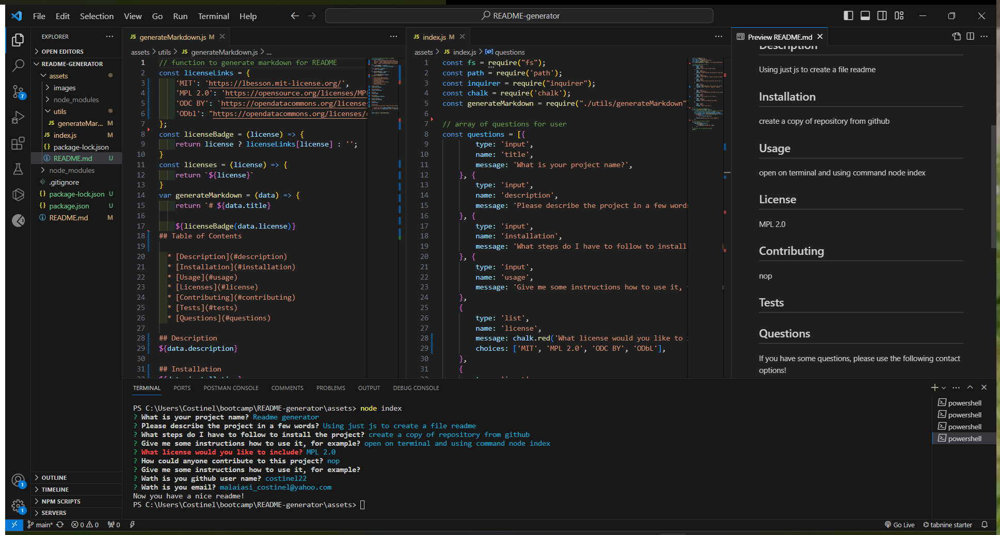

# README-generator
A simple way to create  README file and fill using a terminal

## Description

- I did that to create a simple README file and fill using a terminal.
- I find i easy mode to create a README file using just js, and fill it with the terminal.
- And lock on images folder to see a new README.md generated.

## Table of Contents (Optional)

- [Installation](#installation)
- [Usage](#usage)
- [License](#license)

## GIF video

## Installation

Create a copy from github repository.
install "npm i inquirer@6.5.1 --save"

https://github.com/Costinel22/README-generator

## Usage

## License

MIT License

## Tests

